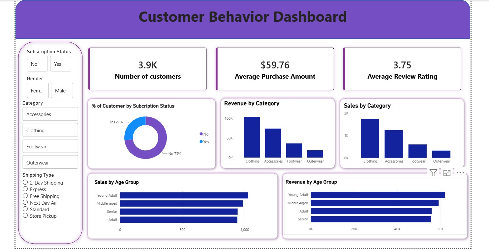

# 🧾 Customer Shopping Behavior Data Analysis Portfolio Project 

_Analyzing cunsumor data  and profitability to support strategic purchasing and inventory decisions using SQL, Python, and Power BI._

---

## 📌 Table of Contents
- <a href="#overview">Overview</a>
- <a href="#business-problem">Business Problem</a>
- <a href="#dataset">Dataset</a>
- <a href="#tools--technologies">Tools & Technologies</a>
- <a href="#project-structure">Project Structure</a>
- <a href="#data-cleaning--preparation">Data Cleaning & Preparation</a>
- <a href="#exploratory-data-analysis-eda">Exploratory Data Analysis (EDA)</a>
- <a href="#research-questions--key-findings">Research Questions & Key Findings</a>
- <a href="#dashboard">Dashboard</a>
- <a href="#how-to-run-this-project">How to Run This Project</a>
- <a href="#final-recommendations">Final Recommendations</a>
- <a href="#author--contact">Author & Contact</a>

---
<h2><a class="anchor" id="overview"></a>Overview</h2>

This project evaluates vendor performance and retail inventory dynamics to drive strategic insights for purchasing, pricing, and inventory optimization. A complete data pipeline was built using SQL for ETL, Python for analysis and hypothesis testing, and Power BI for visualization.

---
<h2><a class="anchor" id="business-problem"></a>Business Problem</h2>


- Understand customer shopping behavior across different demographics, product categories, and sales channels (online vs. offline).
- Identify key factors influencing purchasing decisions, such as discounts, product reviews, seasonality, and payment preferences.
- Analyze changes in buying patterns to uncover emerging trends and shifts in customer preferences.
- Determine drivers of repeat purchases and long-term customer loyalty.
- Use data-driven insights to improve customer engagement and satisfaction.
-Optimize marketing strategies by targeting the right customers with relevant offers and channels.
-Enhance product and pricing strategies to maximize sales and business growth.

---
<h2><a class="anchor" id="dataset"></a>Dataset</h2>

- CSV file located in `/data/` folder 

---

<h2><a class="anchor" id="tools--technologies"></a>Tools & Technologies</h2>

- SQL (Common Table Expressions, Joins, Filtering)
- Python (Pandas, Matplotlib, Seaborn)
- Power BI (Interactive Visualizations)
- GitHub

---
<h2><a class="anchor" id="project-structure"></a>Project Structure</h2>

```
customer-shopping-behavior-analysis/
│
├── README.md
├── .gitignore
├── requirements.txt
├── Customer Shopping Behavior Analysis Report.pdf
│
├── notebooks/                  # Jupyter notebooks
│   ├── Customer_shopping_behavior_Analysis.ipynb.ipynb
│
│
├── dashboard/                  # Power BI dashboard file
│   └── customer_performance_dashboard.pbix
```

---
<h2><a class="anchor" id="data-cleaning--preparation"></a>Data Cleaning & Preparation</h2>

- Cleaned a dataset of 3,900 customer purchase records
- Handled missing values in Review Rating using median imputation by product category
- Standardized column names using snake_case
- Engineered new feature such as age_group and purchase frequency
- Removed redundant columns to improve data consistency
- Loaded cleaned data into SQL Server for SQL analysis

---
<h2><a class="anchor" id="exploratory-data-analysis-eda"></a>Exploratory Data Analysis (EDA)</h2>

- Analyzed customer demographics, spending patterns, and product categories
- Studied the impact of discounts, subscriptions, and shipping types
- Identified top-performing products and high-value customer segments
-Segmented customers into New,Returning, and Loyal groups 

---
<h2><a class="anchor" id="research-questions--key-findings"></a>Research Questions & Key Findings</h2>

1. Subscribers and repeat buyers spend more on average
2. Express shipping users show higher purchase values
3. Discounts do not always reduce spend; some high-value customers use discounts
4. A few products and categories contribute most to total revenue
5. Certain products are highly dependent on discounts and need margin control

---
<h2><a class="anchor" id="dashboard"></a>Dashboard</h2>

- Power BI Dashboard shows:
  - Customer-wise subscription status 
  - Revenue by category
  - Sales by category
  - Revenue by Age group
  - sales by Age group



---
<h2><a class="anchor" id="how-to-run-this-project"></a>How to Run This Project</h2>

1. Clone the repository:
```bash
git clone https://github.com/devikashendge/customer_shopping_behavior_data_analysis.git
```
2. **Open customer_shopping_behavior_Analysis.ipynb notebook***
        This file contains:
        - Data Import
        - Data exploration
        - Data Cleaning
        - connection to SQL Database
        
3. **Load the data from  jupyter notebook into SQL Server Management**
        -create a database in SQL
        - Run python code to load data into SQL databas
        - Open  **SQLQuery3.sql**
        - Answer Business Questions using SQL Queries
        
4. **Connect the SQL Database to Power BI**
        -Open **customer_report.pbix**
        - create interactive dashboard n Power BI
        
5. **Create Project Report and Presentation**
        - create project report
        - Build presentation deck using Gamma AI

---
<h2><a class="anchor" id="final-recommendations"></a>Final Recommendations</h2>

- Promote exclusive benefits for subscribers to increase subscription adoption.
- Strengthen customer loyalty programs by rewarding repeat buyers and moving them into the “Loyal” segment.
- Review and optimize discount policies to balance sales growth with margin control.
- Improve product positioning by highlighting top-rated and best-selling products in campaigns.
- Focus targeted marketing efforts on high-revenue age groups and express-shipping customers.

---
<h2><a class="anchor" id="author--contact"></a>Author & Contact</h2>

**Devika Shendge**  
Data Analyst  
📧 Email: devikashendge009@gmail.com.com  
🔗 [LinkedIn](https://www.linkedin.com/in/devika-shendge-0750183a1/)  

